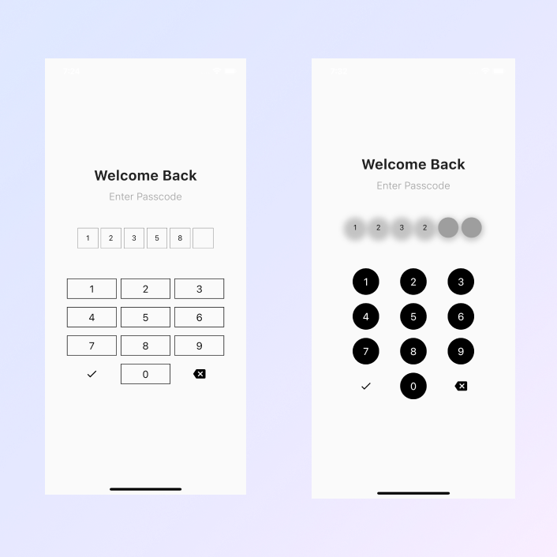

# pin_plus_keyboard

A flutter package that gives you custom input fields and a custom keyboard for one time password widgets, transaction pin widgets and simple login widgets

<!-- ## Features

TODO: List what your package can do. Maybe include images, gifs, or videos. -->

## Getting started

To get started with this package: "add the dependency to your [pubspec.yaml] file"

```yaml
dependencies:
  flutter:
    sdk: flutter
  pin_plus_keyboard:
```

## Usage

[Example] (https://github.com/JoshuaObateru/pin_plus_keyboard/blob/main/example/example.dart)

Note: it is also important that you initialize the pinInputController to start using this package

```dart
  PinInputController pinInputController = PinInputController(length: 6); // the length can vary based on the number of inputs you want

```

### Normal Example

```dart
import 'package:flutter/material.dart';
import 'package:pin_plus_keyboard/package/controllers/pin_input_controller.dart';
import 'package:pin_plus_keyboard/pin_plus_keyboard.dart';

class Example extends StatefulWidget {
  const Example({Key? key}) : super(key: key);

  @override
  State<Example> createState() => _ExampleState();
}

class _ExampleState extends State<Example> {
  PinInputController pinInputController = PinInputController(length: 6); // very important
  @override
  Widget build(BuildContext context) {
    Size size = MediaQuery.of(context).size;

    return Scaffold(
        // ignore: sized_box_for_whitespace
        body: Container(
            width: size.width,
            height: size.height,
            child: Column(
            mainAxisAlignment: MainAxisAlignment.center,
              children: [
                Padding(
                  padding: const EdgeInsets.symmetric(vertical: 4.0),
                  child: Text(
                    "Welcome Back",
                    style: TextStyle(
                      fontSize: size.width * 0.07,
                      fontWeight: FontWeight.bold,
                    ),
                  ),
                ),
                Padding(
                  padding: const EdgeInsets.all(8.0),
                  child: Text(
                    "Enter Passcode",
                    style: TextStyle(
                        color: Colors.grey,
                        fontWeight: FontWeight.w300,
                        fontSize: size.width * 0.05),
                    textAlign: TextAlign.center,
                  ),
                ),
                SizedBox(
                  height: size.height * 0.05,
                ),
                PinPlusKeyBoardPackage(
                  spacing: size.height * 0.06,
                  pinInputController: pinInputController,
                  onSubmit: () {
                    // ignore: avoid_print
                    print("Text is : " + pinInputController.text);
                  },
                ),
              ],
            )));
  }
}

```

### Example with filled and rounded inputs and buttons

```dart
 PinPlusKeyBoard2(
    keyboardButtonShape: KeyboardButtonShape.circlar,
    inputShape: InputShape.circlar,
    keyboardMaxWidth: 70,
    inputHasBorder: false,
    inputFillColor: Colors.grey,
    inputElevation: 3,
    buttonFillColor: Colors.black,
    btnTextColor: Colors.white,
    spacing: size.height * 0.06,
    pinInputController: pinInputController,
    onSubmit: () {
        // ignore: avoid_print
        print("Text is : " + pinInputController.text);
            },
),

```

<!--   -->

<!-- 
 -->



## Properties

| property                |         type          |              default               |                                  description                                   | required |
| :---------------------- | :-------------------: | :--------------------------------: | :----------------------------------------------------------------------------: | :------: |
| keyboardButtonShape     | `KeyboardButtonShape` | `KeyboardButtonShape.defaultShape` |                      Rounded, Circular or Square buttons                       | `false`  |
| inputShape              |     `InputShape`      |     `InputShape.defaultShape`      |                    Rounded, Circular or Square input fields                    | `false`  |
| keyboardMaxWidth        |       `double`        |                `80`                |    Horizontal space that the keyboard occupies on the phone screen(max:100)    | `false`  |
| keyboardVerticalSpacing |       `double`        |                `8`                 |               Vertical space between the buttons on the keyboard               | `false`  |
| spacing                 |       `double`        |               `null`               |                Space between the input fields and the keyboard                 |  `true`  |
| buttonFillColor         |        `Color`        |        `Colors.transparent`        |                       Fill color of the Keyboard buttons                       | `false`  |
| buttonBorderColor       |        `Color`        |           `Colors.black`           |            Border color of keyboard buttons if btnHasBorder == true            | `false`  |
| btnHasBorder            |        `bool`         |               `true`               |                      Gives the keyboard buttons a border                       | `false`  |
| btnTextColor            |        `Color`        |               `null`               |                           Color of the number Inputs                           | `false`  |
| btnBorderThickness      |       `double`        |               `null`               |             Thicknes of the button borders if btnHasBorder == true             | `false`  |
| btnElevation            |       `double`        |               `null`               |                      Shadow elevation of button on y axis                      | `false`  |
| btnShadowColor          |        `Color`        |               `null`               |                 Shadow color of button if btnElevation != null                 | `false`  |
| inputSize               |       `double`        |               `null`               |                          Size of the input containers                          | `false`  |
| isInputHidden           |        `bool`         |              `false`               |                          Hide input as the user types                          | `false`  |
| inputHiddenColor        |        `Color`        |               `null`               |                 Hidden input overlay if isInputHidden == true                  | `false`  |
| inputsMaxWidth          |       `double`        |                `70`                |            Maximum Horizontal space the input boxes ocupy (max:100)            | `false`  |
| pinInputController      | `PinInputController`  |               `null`               |      Stores the text and handles the number of input fields on the screen      |  `true`  |
| onSubmit                |     `Function()`      |               `null`               | Function called on click of the done button or when user has filled all inputs |  `true`  |
| inputFillColor          |        `Color`        |               `null`               |                       Default Fill color of empty Inputs                       | `false`  |
| inputBorderColor        |        `Color`        |               `null`               |             Border color of input fields if inputHasBorder == true             | `false`  |
| inputTextColor          |        `Color`        |               `null`               |                          Color of the numbers filled                           | `false`  |
| inputHasBorder          |        `bool`         |               `true`               |                        Gives the input fields a border                         | `false`  |
| inputBorderThickness    |       `double`        |               `null`               |         Thicknes of the input field borders if inputHasBorder == true          | `false`  |
| inputElevation          |       `double`        |               `null`               |                   Shadow elevation of input fields on y axis                   | `false`  |
| inputShadowColor        |        `Color`        |               `null`               |             Shadow color of input fields if inputElevation != null             | `false`  |
| errorColor              |        `Color`        |            `Colors.red`            |                            Color of the error text                             | `false`  |

<!-- ## Additional information

TODO: Tell users more about the package: where to find more information, how to
contribute to the package, how to file issues, what response they can expect
from the package authors, and more. -->

<!-- # pin_plus_keyboard

# pin_plus_keyboard

# pin_plus_keyboard

# pin_plus_keyboard -->
